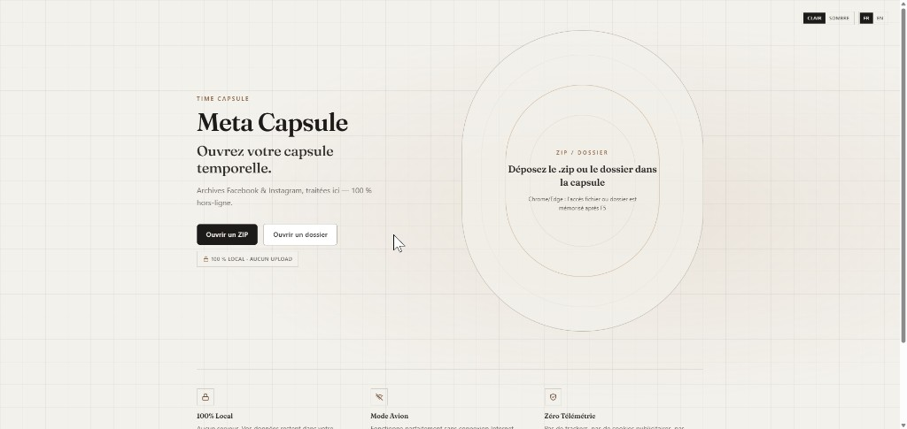
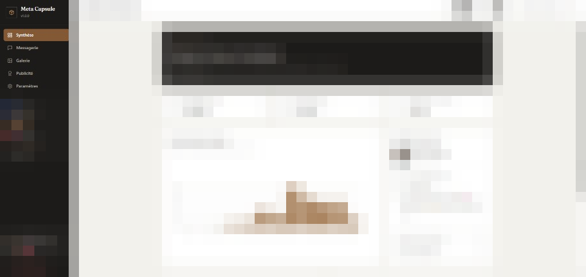
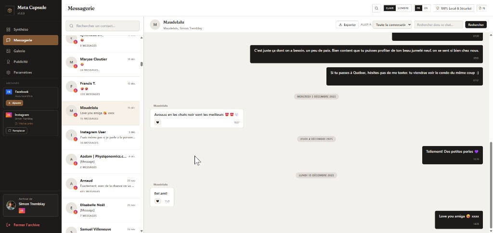
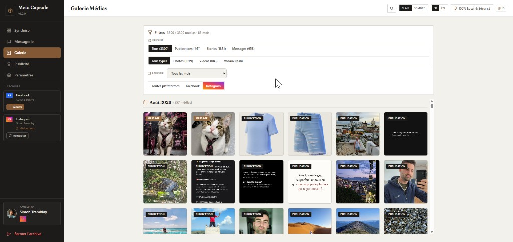

# Meta Capsule

> Redécouvrez vos archives Facebook & Instagram — 100 % hors-ligne, dans votre navigateur.

Meta Capsule est une application web (SPA) qui transforme un export Meta (fichier `.zip` **ou** dossier dézippé) en espace de consultation : messages, médias, publications et transparence publicitaire. Aucun serveur applicatif ne reçoit vos archives. L’interface est en **français** et en **anglais**.

## Ce que c’est / n’est pas


| Oui                                            | Non                                         |
| ---------------------------------------------- | ------------------------------------------- |
| Traitement local du ZIP ou du dossier          | Connexion aux API Meta                      |
| Persistance IndexedDB sur votre machine        | Upload de vos données vers un backend       |
| Facebook **et** Instagram (archives additives) | Édition ou suppression sur vos comptes Meta |
| Lecture seule de souvenirs déjà exportés       | Réseau social, notifications, feed          |

## 🖼 Aperçu

| Landing | Synthèse |
| --- | --- |
|  |  |
| **Messagerie** | **Galerie** |
|  |  |

## 📦 Obtenir une archive Meta

Facebook et Instagram s’exportent au même endroit : le [Accounts Center](https://accountscenter.facebook.com/). Un lien, deux plateformes.

**Passez par le navigateur web.** L’app mobile (Facebook / Instagram) n’offre qu’un export restreint : moins d’options de période, de qualité et de format, et le ZIP se télécharge de toute façon depuis un navigateur.

### 🌐 Depuis le navigateur (recommandé)

1. Ouvrez le [Accounts Center](https://accountscenter.facebook.com/) et connectez-vous si besoin.
2. Dans le menu de gauche, ouvrez **Your information and permissions**.
3. Cliquez **Export your information** → **Create export** (selon l’écran : **Export to device**).
4. Choisissez le profil à exporter (Facebook **ou** Instagram). Répétez ensuite pour l’autre plateforme si vous voulez les deux.
5. Sélectionnez **Export to device** (pas « Export to external service »).
6. Réglez l’export ainsi — c’est ce que Meta Capsule attend :
  - **Date range** : **All time** (toutes vos données)
  - **Format** : **JSON** (pas HTML)
  - **Media quality** : **Higher quality** (qualité originale)
7. Lancez l’export (**Start export**). Meta vous envoie un e-mail quand l’archive est prête (parfois plusieurs heures ou jours).
8. Téléchargez le `.zip` depuis Accounts Center (le lien n’est valable que quelques jours).

Les libellés du Accounts Center sont souvent en anglais, même si Facebook est en français.

Un ZIP **par plateforme**. Les exports HTML de Meta ne sont pas lus.

### 📱 Via l’app mobile (limité)

Vous pouvez ouvrir Accounts Center depuis Réglages → Compte Meta, mais les options d’export y sont réduites. Pour un ZIP complet (toute la période, JSON, haute qualité), utilisez le parcours navigateur ci-dessus.

## 📂 Ouvrir dans Meta Capsule

1. Ouvrez l’app, puis déposez le `.zip` **ou** le dossier déjà dézippé (bouton « Ouvrir un dossier »).
2. Ajoutez la seconde plateforme depuis la barre latérale ou les paramètres.
3. Laissez l’onglet ouvert pendant l’import : un gros ZIP peut prendre quelques minutes.

**Chrome** ou **Edge** : l’accès au fichier ou au dossier est mémorisé après un F5 (File System Access API).

**Firefox** / **Safari** : l’index (messages, légendes) reste local ; pour revoir les images, resélectionnez le ZIP ou le dossier.

## ✨ Fonctionnalités

- **Synthèse** — volume, timeline, profil, « ce jour-là », conversations les plus denses
- **Messagerie** — Messenger / Instagram Direct, recherche dans le fil, saut année/mois, pièces jointes à la demande
- **Galerie** — grille chronologique, filtres origine / type / plateforme / mois
- **Publicité** — centres d’intérêt et annonceurs présents dans l’export
- **Recherche globale** — messages et légendes (`Ctrl+K`)
- **Export local** — une photo, ou un fil en HTML (téléchargement navigateur, pas d’upload)
- **Multi-archives** — Facebook et Instagram séparément ; remplacer l’une n’efface pas l’autre
- **Confort** — PWA (interface seulement), thème clair / sombre / système, FR / EN
- **Souveraineté** — tout effacer depuis les paramètres

Les médias ne sont pas copiés en base : métadonnées en IndexedDB, blobs extraits du ZIP ou du dossier à l’affichage.

## 🔒 Confidentialité

- Les archives ne quittent pas votre navigateur. Pas de télémétrie, pas de trackers publicitaires.
- Stockage local uniquement (IndexedDB + handles de fichiers quand le navigateur le permet).
- Vous pouvez tout supprimer à tout moment.
- **Premier chargement** : l’app et les polices passent par le réseau. Ensuite, consultation possible hors ligne.
- **PWA** : le navigateur met en cache l’interface, jamais vos ZIP ni IndexedDB.

## 🛠 Développer

```bash
npm install
npm run dev
```

Autres scripts : `npm run build`, `npm run preview`, `npm run release -- patch|minor|major`.

Historique des versions : [CHANGELOG.md](./CHANGELOG.md).

- **UI** — React 18, TypeScript, Vite, Tailwind CSS, lucide-react
- **Base locale** — Dexie.js (IndexedDB)
- **Archives** — `@zip.js/zip.js` dans un Web Worker

Détail technique : [ARCHITECTURE.md](./ARCHITECTURE.md).

## 🤝 Contribuer

PR et retours bienvenus — priorité à la simplicité, la performance et la confidentialité. Voir [docs/roadmap.md](./docs/roadmap.md) pour le périmètre (pas de sync, pas de télémétrie).

## 📄 Licence

[MIT](./LICENSE) — libre d’usage, de modification et de redistribution.

---

*Conçu pour redonner à chacun la souveraineté sur ses souvenirs numériques.*
