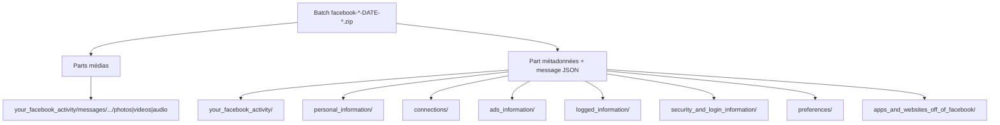

# Cartographie export Facebook

Référence pour les exports Facebook **JSON** (Accounts Center → Export to device).  
Volumes et schémas issus d’un export réel multi-parties analysé in-place (août 2026) — **aucune donnée personnelle** dans ce document.

Meta Capsule consomme déjà le cœur Tier S (profil, Messenger inbox + message_requests, posts `your_posts*`, intérêts pubs). Ce doc cartographie le reste pour ajuster le worker plus tard.

---

## Point critique : exports multi-ZIP

Les gros exports Facebook sont souvent découpés en **plusieurs** `.zip` du même batch (`facebook-<user>-YYYY-MM-DD-<id>.zip`).

| Observation (batch analysé) | Détail |
|-----------------------------|--------|
| Nombre de parties | ~22 ZIP |
| Partie pointée (`…-voL2Y9ou.zip`) | **Médias Messenger uniquement** (~1,49 Go, ~2827 fichiers, **0 JSON**) |
| Partie métadonnées (`…-d0lu41ls.zip`) | Profil, posts, ads, connexions, **~1888** `message_*.json`, etc. |
| Autres parties | Surtout binaires messages / posts |
| Stub | Souvent un `facebook_<id>.zip` vide (0 octet) à la racine de chaque partie |

**Conséquence produit** : un seul ZIP Facebook peut ne contenir **aucun** JSON. Pour une archive complète, importer le **dossier dézippé fusionné** (ou toutes les parties). Meta Capsule gère déjà ZIP **ou** dossier.

---

## Vue d’ensemble (export logique fusionné)

| Dossier | Rôle typique |
|---------|----------------|
| `your_facebook_activity/` | Posts, albums, Messenger, comments/reactions, groups, events, marketplace, … |
| `personal_information/` | Profil (`profile_v2`), devices, contacts |
| `connections/` | Friends, followers, following, friend requests |
| `ads_information/` | Advertisers, préférences pubs, apps détectées |
| `logged_information/` | Ads interests, recherches, locations, items viewed |
| `security_and_login_information/` | Account activity, sessions, IP |
| `preferences/` | Feed, privacy, notifications, dark mode, … |
| `apps_and_websites_off_of_facebook/` | Apps connectées, activité hors Meta |

Pas de top-level `media/` comme Instagram : les binaires vivent surtout sous `your_facebook_activity/messages/…` et `your_facebook_activity/posts/…`.

### Messenger — volumes observés

| Emplacement threads | Threads (JSON part) | Notes |
|---------------------|--------------------:|-------|
| `messages/inbox/` | ~1364 | Cœur produit ; médias souvent dans d’autres ZIP |
| `messages/archived_threads/` | ~335 | Même schéma messages |
| `messages/filtered_threads/` | ~71 | Même schéma |
| `messages/message_requests/` | ~3 | Déjà parsé par Capsule |
| `messages/e2ee_cutover/` | ~103 | Cutover E2EE ; volume média important |

Pagination : un `message_1.json` peut contenir jusqu’à **10 000** messages ; suite en `message_2.json`, etc.

Partie média seule (`voL2Y9ou`) : inbox ~52 dossiers avec fichiers, archived ~6, e2ee_cutover ~19 — photos/vidéos/audio/gifs/pdf, pas de JSON.

---

## Formats JSON récurrents

1. **Objets Meta « v2 »** — wrappers typés (`profile_v2`, `friends_v2`, `comments_v2`, `topics_v2`, `searches_v2`, …).
2. **Posts / comments** — `{ timestamp, title, data[], attachments[] }` avec `data[].post` / `data[].comment` et `attachments[].data[].media.uri`.
3. **`label_values`** — comme Instagram (`likes_and_reactions`, advertisers, marketplace listings).
4. **Threads Messenger** — même famille qu’IG : `participants`, `title`, `thread_path`, `messages[]` (`sender_name`, `timestamp_ms`, `content`, `photos|videos|audio_files|files|gifs|sticker|share|reactions|call_duration`).

**Encodage** : mojibake fréquent (UTF-8 relu comme Latin-1). Correction via [`src/utils/metaDecoder.ts`](../src/utils/metaDecoder.ts).

---

## Datasets par richesse

### Tier S — cœur produit

| Dataset | Chemins typiques | Notes |
|---------|------------------|-------|
| Profil | `personal_information/profile_information/profile_information.json` | `profile_v2` : name, emails, birthday, gender, cities, work/edu, phones, … |
| Messenger | `…/messages/inbox|message_requests/<thread>/message_*.json` + binaires | Tier S ; multi-ZIP |
| Posts | `…/posts/your_posts__check_ins__photos_and_videos_*.json` | Nom composé (plus `your_posts_1.json` classique) |
| Albums / photos / videos | `…/posts/album/{N}.json`, `your_uncategorized_photos.json`, `your_videos.json` | `uri` + EXIF possible |
| Ads interests | `logged_information/other_logged_information/ads_interests.json` | `topics_v2` : liste de strings |

### Tier A — graphe / engagement / fils étendus

| Dataset | Chemins / volume observé |
|---------|--------------------------|
| Archived / filtered / e2ee_cutover | Même schéma que inbox — **pas encore ingéré** |
| Comments | `…/comments_and_reactions/comments.json` (~3200) |
| Likes & reactions | `likes_and_reactions.json` + `_1`…`_N` (~20k) — labels `Name`, `Reaction`, `Title`, `URL` |
| Friends | `connections/friends/your_friends.json` (`friends_v2`) |
| Following / followers | `connections/followers/…` |
| Friend requests / removed | received, sent, rejected, removed |
| Pages liked | `…/pages/pages_you've_liked.json` |
| Groups | membership + group posts/comments |
| Tagged in | `activity_you're_tagged_in/…` |
| Saved items | `saved_items_and_collections/…` |

### Tier B — analytics compte & sécurité

- Search history (`your_search_history.json`)
- Items viewed / marketplace interactions / feed content
- Account activity, sessions, IP (`security_and_login_information/`)
- Off-Meta activity + connected apps
- Marketplace listings & conversations
- Events (responses / invitations)
- Devices

### Tier C — secondaire / sensible

- Contacts importés / synchronisés — **haute sensibilité**, hors UX archive par défaut
- Dating (profil + messages)
- Gaming, payments, fundraisers, avatars
- Préférences pubs détaillées, story views 7 jours, sampled locations

---

## Schémas utiles (clés seulement)

### `profile_v2`

`name` (first/middle/last/full), `emails`, `birthday`, `gender`, `current_city`, `hometown`, `places_lived`, `family_members`, `education_experiences`, `work_experiences`, `languages`, `phone_numbers`, `relationship`, `previous_*`, `websites`, `profile_uri`, `registration_timestamp`.

### Post item

- Clés : `timestamp`, `title`, `data`, `attachments`
- `data[]` : `post`, `update_timestamp`, `backdated_timestamp`
- `attachments[].data[]` : `media` | `external_context` | `text` | `place` | `life_event` | `event`
- `media` : `uri`, `creation_timestamp`, `title`, `description`, `media_metadata` (EXIF)

### Message (échantillon inbox)

Clés fréquentes : `sender_name`, `timestamp_ms`, `content`, `reactions`, `photos`, `audio_files`, `share` (`link`, `share_text`), `videos`, `gifs`, `files`, `call_duration`, `sticker`.

---

## Correspondance Meta Capsule

| Donnée export | Couverture actuelle |
|---------------|---------------------|
| `profile_information.json` → `profile_v2` | Oui → `profiles` |
| `messages/inbox/` + `message_requests/` | Oui → `conversations`, `messages` |
| `messages/archived_threads\|filtered_threads\|e2ee_cutover/` | Oui (même parseur que inbox) |
| `posts/your_posts*` (y compris `your_posts__check_ins__…`) | Oui (`includes('posts/your_posts')`) → `posts` |
| `posts/album/*`, uncategorized photos/videos | Oui → `posts` (+ GPS EXIF JSON → `media.latitude/longitude`) |
| `ads_interests.json` (`topics_v2`) | Oui → `adTargeting.interests` |
| `advertisers_who_uploaded*` | Ancien nom — encore matché si présent |
| `advertisers_using_your_activity_or_information.json` | Oui → `adTargeting.advertisers` |

Ingest : [`src/workers/ingestion.worker.ts`](../src/workers/ingestion.worker.ts).  
Cartographie Instagram : [`instagram-export-map.md`](instagram-export-map.md).

---

## Différences vs Instagram

| | Facebook | Instagram |
|--|----------|-----------|
| Racine activité | `your_facebook_activity/` | `your_instagram_activity/` |
| Médias | Sous activity (messages/posts) ; souvent **multi-ZIP** | Top-level `media/posts\|stories\|other/` |
| Profil | `profile_v2` objet imbriqué | `string_map_data` / labels |
| Posts | `your_posts__…` + `album/N.json` | `posts_1.json` + `posts.json` + binaires `media/` |
| Messenger | + archived, filtered, **e2ee_cutover** | inbox + message_requests |
| Ads interests | Sous `logged_information/…` | Souvent `ads_information/` |
| Livraison | Plusieurs ZIP ~0,5–1,5 Go | Plus souvent un archive cohérente |

---

## Pistes d’ajustement worker (plus tard)

1. **Multi-partie / dossier** — documenter clairement dans l’UI : un ZIP Facebook seul peut être media-only.
2. Étendre les messages à `archived_threads`, `filtered_threads`, `e2ee_cutover` (même parseur que inbox).
3. Parser `advertisers_using_your_activity_or_information.json` (remplace l’ancien nom Capsule).
4. Ingérer albums / `your_uncategorized_photos` / `your_videos` pour enrichir posts + galerie.
5. (Optionnel) comments, likes, friends — seulement s’ils aident à *rouvrir* la capsule.

Garde-fou produit : pas d’onglet analytics pour l’analytics.
