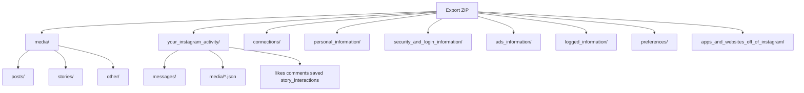

# Cartographie export Instagram

Référence pour les exports Instagram **JSON** (Accounts Center → Export to device).  
Volumes et comptes issus d’un export réel analysé in-place (juillet 2026, ~1,6 Go, ~4291 fichiers) — **aucune donnée personnelle** dans ce document.

Meta Capsule consomme déjà le cœur Tier S (profil, DMs, posts/stories, médias, pubs). Ce doc cartographie le reste pour les évolutions futures.

Voir aussi la cartographie Facebook : [`facebook-export-map.md`](facebook-export-map.md).

---

## Vue d’ensemble

| Dossier | Rôle typique |
|---------|----------------|
| `media/` | Binaires (stories souvent dominantes en volume) |
| `your_instagram_activity/` | Index JSON + DMs + engagement |
| `connections/` | Followers / following / close friends / blocks |
| `security_and_login_information/` | Logins, localisation, changements profil |
| `ads_information/` | Pubs vues, intérêts, advertisers |
| `logged_information/` | Insights, recherches, link history |
| `personal_information/` | Profil, device, locations |
| `preferences/` | Consents, notifs, topics |
| `apps_and_websites_off_of_instagram/` | Apps / activité hors Meta |

Ordre de grandeur observé : ~2230 fichiers sous `media/` (~1,36 Go), ~2000 sous `your_instagram_activity/` (surtout DMs), le reste en petits JSON.

---

## Formats JSON récurrents

Instagram mélange **trois formes** :

1. **`label_values`** — `{ timestamp, media, label_values:[{label, value|href|title|timestamp_value}], fbid }`  
   Ex. : likes, saved, story interactions, close friends, ads.
2. **`string_map_data` / `string_list_data`** — clés lisibles (`Comment`, `Time`, …)  
   Ex. : comments, login_activity, followers, contacts, `personal_information.json`.
3. **Schéma média « propre »** — `uri`, `creation_timestamp`, `title`, `media_metadata`  
   Ex. : `stories.json`, `posts_1.json`, `profile_photos.json`.

**Lien média** : binaires sous `media/posts|stories|other/YYYYMM/...` ; les JSON d’index pointent via `uri` (chemin relatif dans le ZIP / dossier).

**Encodage** : beaucoup de chaînes sont en mojibake (UTF-8 relu comme Latin-1). Meta Capsule corrige via [`src/utils/metaDecoder.ts`](../src/utils/metaDecoder.ts) à l’ingest.

---

## Datasets par richesse

### Tier S — cœur produit (déjà / priorité archive)

**Stories** — `media/stories/` + `your_instagram_activity/media/stories.json`
- Gros corpus timeline ; EXIF / GPS / camera souvent présents dans `media_metadata`
- Meilleure surface pour galerie + (plus tard) carte

**DMs** — `your_instagram_activity/messages/inbox|message_requests/<thread>/message_*.json`
- Schéma thread : `participants`, `title`, `messages[]`, `thread_path`, `is_still_participant`
- Message : `sender_name`, `timestamp_ms`, `content`, `share`, `reactions`, `photos|videos|audio_files`, `call_duration`
- `share` : `link`, `share_text`, `original_content_owner`, champs profile share
- Parts paginées `message_1.json`, `message_2.json`, …

**Posts** — `media/posts/` + `posts_1.json` + `posts.json`
- `posts_1.json` (uri + EXIF) pour les fichiers
- `posts.json` (`label_values`) pour captions, geo, device, visibility, paid partnership, etc.
- Utiliser **les deux** quand présents

### Tier A — analytics / graphe (hors scope UI actuel)

| Dataset | Chemin typique | Champs utiles |
|---------|----------------|---------------|
| Liked posts | `…/likes/liked_posts.json` | Username, URL, Caption, Title, timestamp |
| Story likes | `…/story_interactions/story_likes.json` | idem |
| Comments | `…/comments/post_comments_*.json` | Comment, Media Owner, Time |
| Saved | `…/saved/saved_posts.json`, `saved_collections.json` | URL, Username, Caption |
| Followers / Following | `connections/followers_and_following/` | title + href + timestamp |
| Close friends | `…/close_friends.json` | Name, Username, URL |
| Polls / quizzes / questions | `…/story_interactions/` | Question, options, Expiration |

### Tier B — perf & compte

- **Insights** — `logged_information/past_instagram_insights/` (reach, impressions, likes, saves, lives…)
- **Login activity** — IP, User Agent, Time
- **Profile changes** — Change Date, Changed, New/Previous Value
- **Searches** — word/phrase + profile searches
- **Link history** — URLs + sessions

### Tier C — secondaire / sensible

- Ads viewed, videos watched, suggested profiles, « not interested »
- Advertisers using your activity
- **Synced contacts** — haute sensibilité ; ne pas exposer par défaut dans l’UI archive
- Avatars, gifts, monetization, subscriptions — faible valeur produit

---

## Correspondance Meta Capsule

| Donnée export | Table / usage actuel |
|---------------|----------------------|
| Profil (`personal_information.json`) | `profiles` |
| DMs inbox + message_requests | `conversations`, `messages` |
| Posts / stories / other JSON + binaires | `posts`, `media` |
| Intérêts / advertisers (fichiers supportés) | `adTargeting` |
| Followers, likes, comments, insights, GPS carte | Non indexés (volontaire — voir [roadmap](roadmap.md)) |

Ingest : [`src/workers/ingestion.worker.ts`](../src/workers/ingestion.worker.ts). Modèles : [`src/db/models.ts`](../src/db/models.ts).

---

## Limites fréquentes des exports

- Pas (ou peu) de JSON sous `your_instagram_activity/posts/` — médias indexés via `your_instagram_activity/media/`
- Insights « past » incomplets vs Meta Business Suite
- Couverture inégale des interactions stories (`stories_viewed` souvent très petit vs `story_likes`)
- Pas de base SQL dans l’export : fichiers plats + JSON parfois paginé
- Qualité / période dépendent des options choisies à l’export (JSON + Higher quality + All time recommandés — voir README)

---

## Pistes d’évolution (si on élargit le produit)

1. Parser / normaliser davantage de fichiers Tier A–B vers Dexie (ou tables dédiées)
2. Carte GPS à partir d’EXIF stories/posts
3. Graphe followers / following / close friends (sans contacts synchronisés)
4. Insights organiques sur la synthèse

Garde-fou produit : ne pas ajouter d’onglet qui n’aide pas à *rouvrir* la capsule.
